# Intro
In this project, I implemented two vehicle detectors using SVM with HOG (histogram of oriented gradients) and CNN on data from Udacity and GTI dataset. I used the dataset to train the classifiers, which is then used to detect vehicles from images and video.

# Training Data
There are 3425 vehicle images and 3900 non-vehicle images. Each image has resolution of 64 x 64, and 3 channels (RGB). Here are examples of training data:

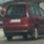

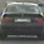

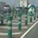
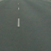
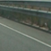
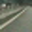
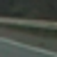

# Features
HOG (https://en.wikipedia.org/wiki/Histogram_of_oriented_gradients) is used with linear SVM, and raw images are used as input to CNN directly.

# Training
- Load training data and apply standard noramlization (zero mean and unit variance.) 
- Images are transfered into HOG feature vectors for SVM classifier.
- Split the training data into training set and validation set (80%:20%).
- I used linearSVM from scikit-learn and built a simple 2 conv layers CNN model using Keras with TensorFlow. Both of the classifiers reach 97% accuracy on validation set, and almost 100% accuracy on training set.

# Detecion
* A sliding window mechanism is used to generate regions of interest. It slides through the input image and feeds the region into classifier. There are 3 to 4 different scales of sliding windows.
* If classifier predicts there's a vehicle within the window, it marks the pixels in a heatmap. The heatmap is a map to record how many times each pixel has been predicted as a vehicle. Here are examples of the process:

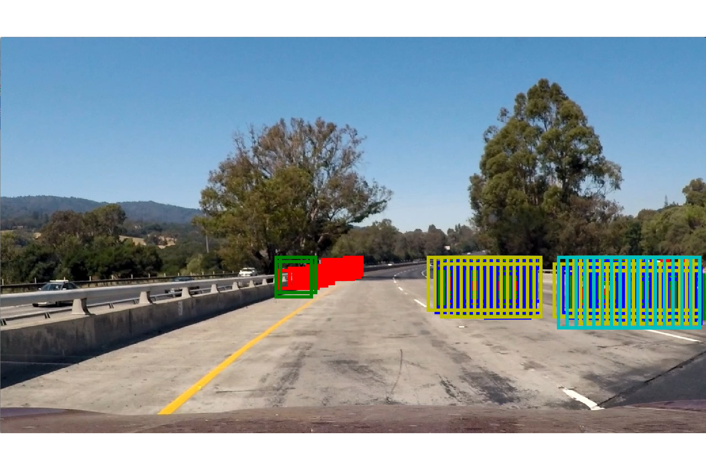
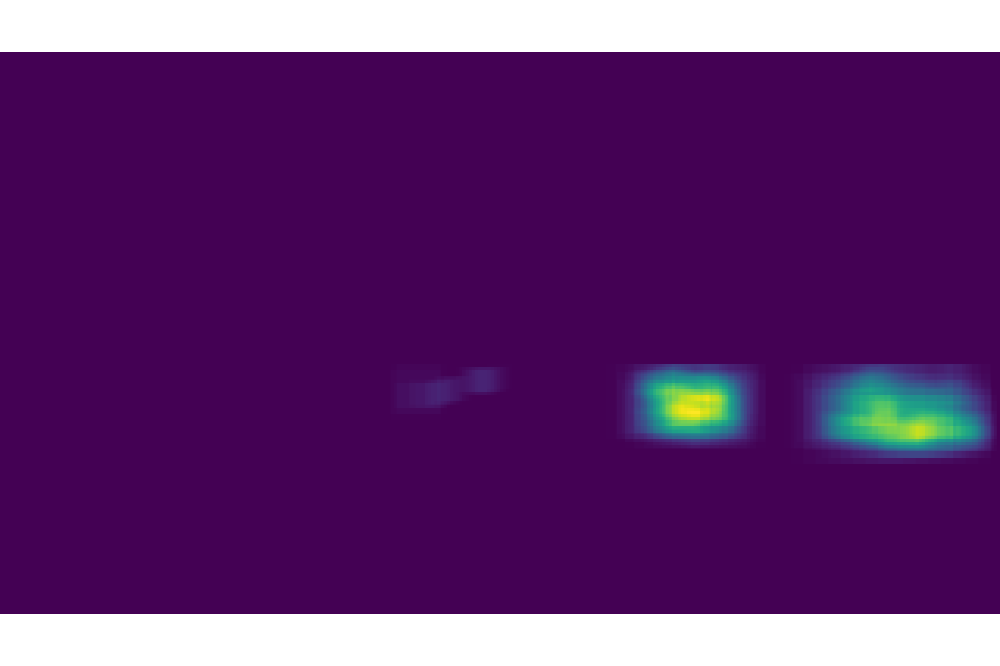
* After generating the heatmap, it applies a threshold to eliminate outliers, and that generates the final heatmap.
* The heatmap is then passed into connected component algorithm and that generates labels for each blobs.
* Finally, it calculates the bounding box of each blob and outputs the coordinates of the boxes. Here are examples of the process:

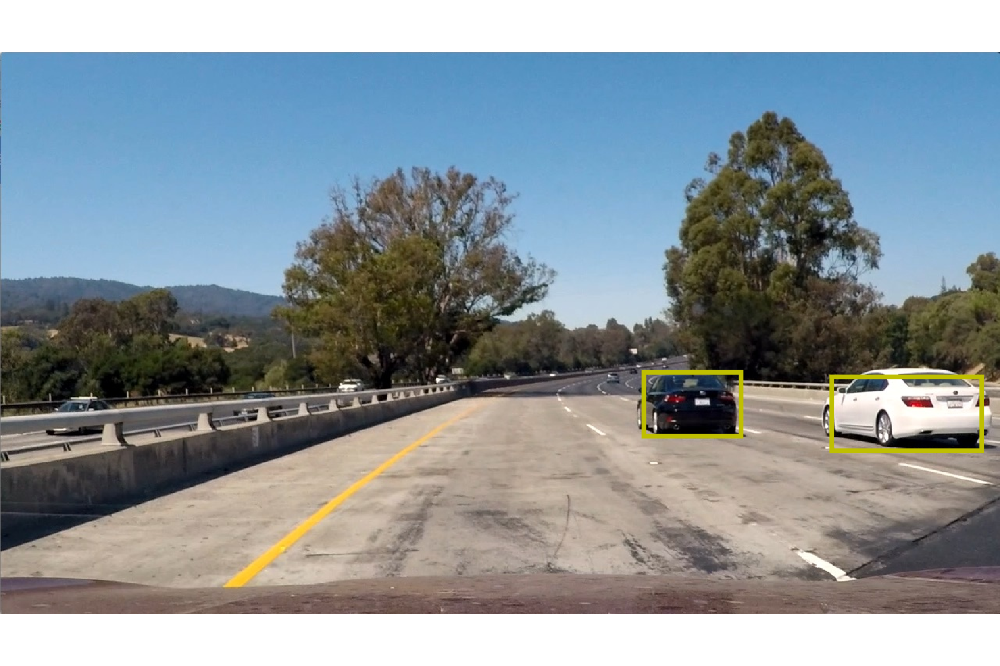
* For video, besides generating heatmap for each frame, IIR filter is applied to heatmaps to stablize the final output. I also tried averaging 5 or 10 frames to stablize the outpu, but it performs worse.   

# Sample result

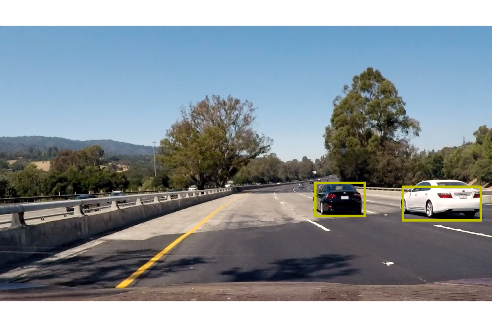
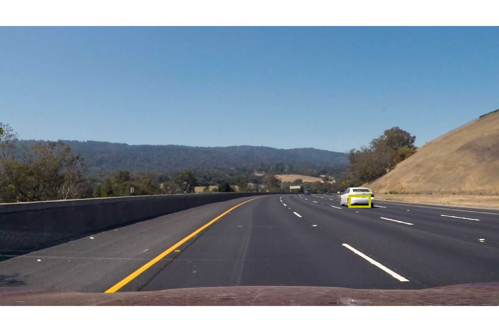

# Final thoughts
* There is a high false positive rate for both CNN and SVM model. Given that both models reach almost 100% accuracy, this is likely caused by training data doesn't represent the real scenario problem. ~6000 images are also small for a dataset.
* Heatmap threashold and IIR filter or averaging frames help, but they won't solve the issue entirely.
* Sliding window is very computational intensive. A region selection algorithm can be used (such as selective search) to achieve higher efficiency.
* RCNN, fast-RCNN, YOLO are all much more efficient than sliding window.
* Kalman-filter should be used for tracking instead of frame by frame processing.
